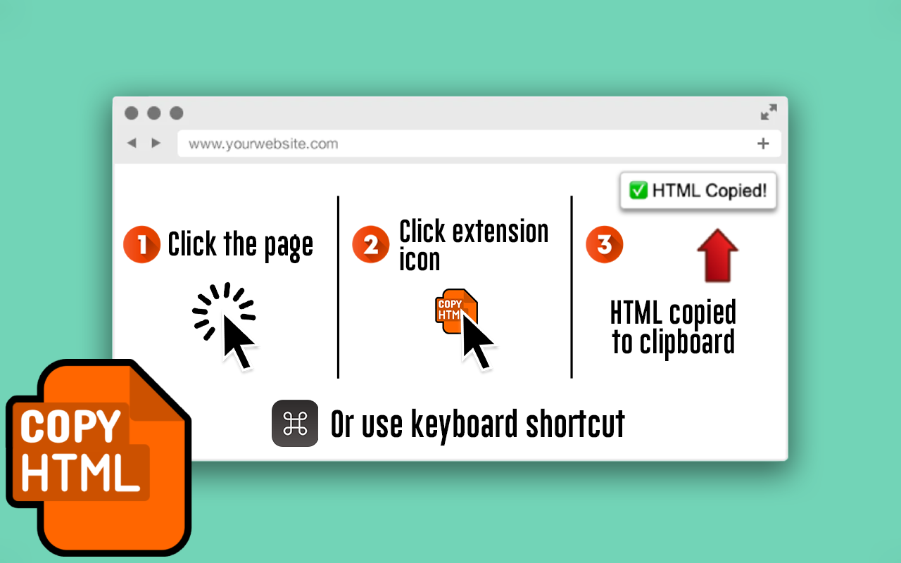

<h2 align="center">
  📃 Copy HTML
</h2>
<h3 align="center">
  Chrome extension to easily copy a page's HTML to the clipboard.
</h3>
<p align="center">
  <a href="https://chrome.google.com/webstore/detail/copy-html/indfogjkdbmkihaohndcnkoaheopbhjf" target="_blank" rel="noopener noreferrer"></a>&nbsp;
  <a href="https://github.com/sponsors/justinmahar" target="_blank" rel="noopener noreferrer"></a>
</p>

[](https://chrome.google.com/webstore/detail/copy-html/indfogjkdbmkihaohndcnkoaheopbhjf)

## Install on Chrome Web Store

Install the plugin at the **[Chrome Web Store](https://chrome.google.com/webstore/detail/copy-html/indfogjkdbmkihaohndcnkoaheopbhjf)**.

## Overview

This Chrome extension allows the user to easily copy the page's HTML element to the clipboard with the press of a button or keyboard shortcut.

Button method:
1. Click the extension icon
2. Click "Copy HTML" button
3. HTML is copied to clipboard

Keyboard shortcut method:
1. Click the page
2. Press the keyboard shortcut: `Ctrl`+`Shift`+`Alt`+`H`
3. HTML is copied to clipboard

## Donate 

If this project helped you, please consider buying me a coffee. Your support is much appreciated!

<a href="https://paypal.me/thejustinmahar/5"></a> <a href="https://paypal.me/thejustinmahar/15"></a> <a href="https://paypal.me/thejustinmahar/25"></a>

## Table of Contents 

- [Install on Chrome Web Store](#install-on-chrome-web-store)
- [Overview](#overview)
- [Donate](#donate)
- [Table of Contents](#table-of-contents)
- [Installation](#installation)
- [Development](#development)
  - [Install Dependencies](#install-dependencies)
  - [Building](#building)
- [Contributing](#contributing)
- [⭐ Found It Helpful? Star It!](#-found-it-helpful-star-it)
- [License](#license)

## Installation

Install via the [Chrome Web Store](https://chrome.google.com/webstore/detail/copy-html/indfogjkdbmkihaohndcnkoaheopbhjf).


## Development

### Install Dependencies

```
npm i 
```

### Building

Run the following:

```bash
npm run build
```

The project will be built and zipped to `/dist`.

## Contributing

Open source software is awesome and so are you. 😎

Feel free to submit a pull request for bugs or additions, and make sure to update tests as appropriate. If you find a mistake in the docs, send a PR! Even the smallest changes help.

For major changes, open an issue first to discuss what you'd like to change.

## ⭐ Found It Helpful? [Star It!](https://github.com/justinmahar/chrome-copy-html/stargazers)

If you found this project helpful, let the community know by giving it a [star](https://github.com/justinmahar/chrome-copy-html/stargazers): [👉⭐](https://github.com/justinmahar/chrome-copy-html/stargazers)

## License

See [LICENSE.md](https://raw.githubusercontent.com/justinmahar/chrome-copy-html/master/LICENSE.md).
